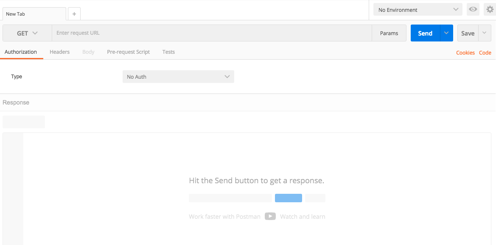
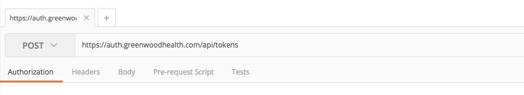
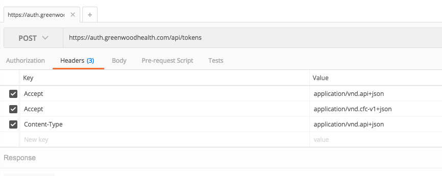
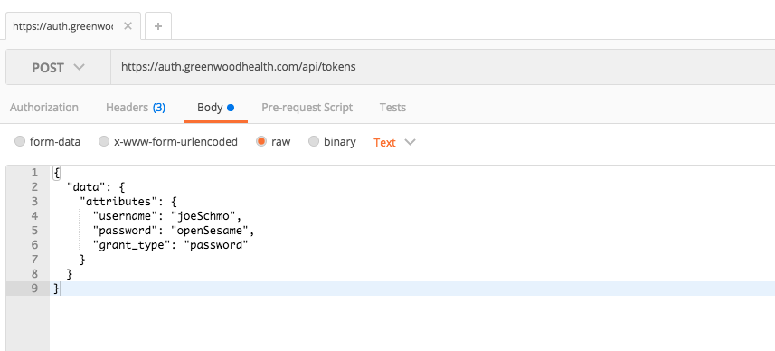
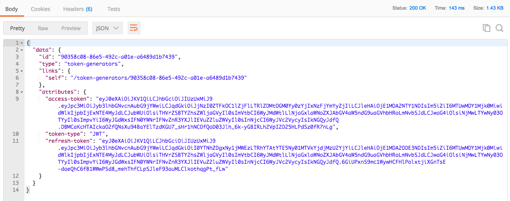
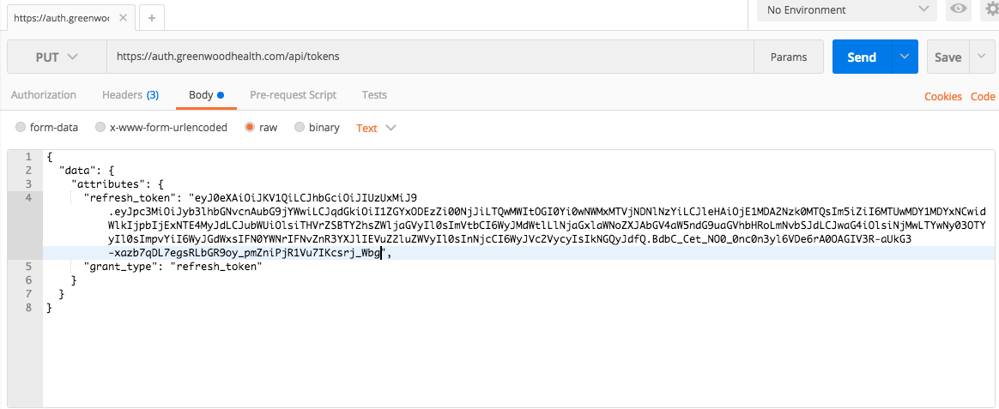
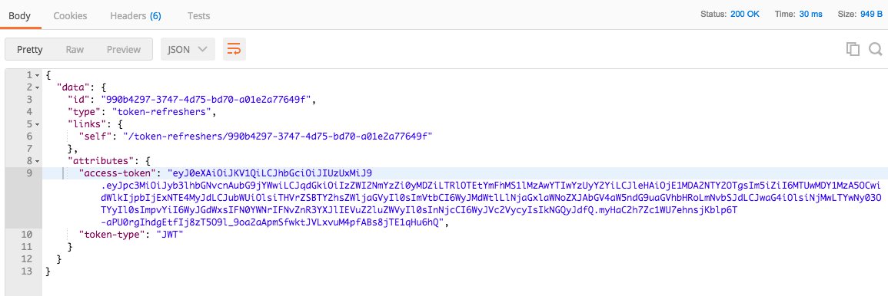
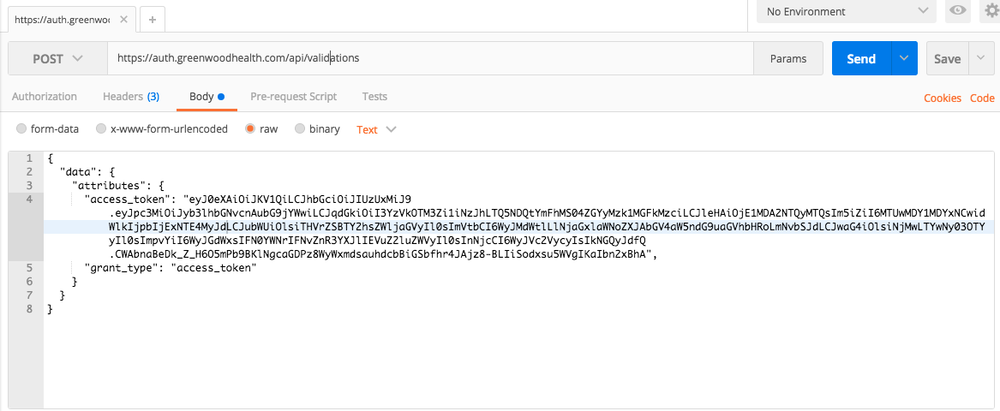
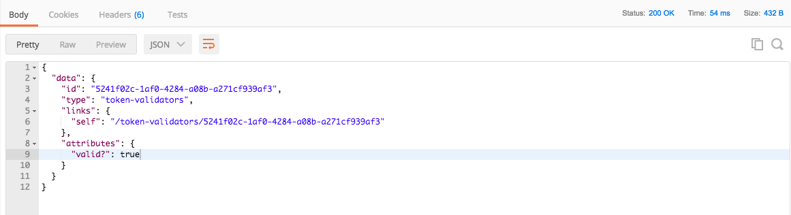

# LDAP OAuth2 Provider
A dedicated adaptor connector to transform an LDAP authentication into a [JWT](https://jwt.io/) to help with single sign-on integration.

## What This Does
This application provides a [JSON API-compliant](http://jsonapi.org/) API for authentication against an LDAP directory such as Active Directory or Open Directory. It does so by issuing a [JWT](https://jwt.io/) when presented with a valid username and password pair. It also provides an endpoint to validate and refresh your JWTs. This application offers its service over HTTPS, with free, automated SSL certificates from [Let's Encrypt](https://letsencrypt.org/).

## How To Run
*We have created a setup script to run this service for your convenience. That setup script will create a Docker image that serves this application, install an init.d script, and spin up the Docker container automatically. This script can be found at [https://github.com/ConnectedforCare/ldap-oauth2-provider-init-script](https://github.com/ConnectedforCare/ldap-oauth2-provider-init-script).*

If you'd rather set up this service manually, you'll need to do the following **(Note: It is much easier to use the setup script/Docker container in the repo found above)** :

1. [Download, install and run redis](https://redis.io/) for background job SSL cert retrieval with Sidekiq `redis-server --daemonize yes`

2. `git clone https://github.com/ConnectedforCare/ldap-oauth2-provider.git` and `cd ldap-oauth2-provider`

3. Replace the commented settings in config/ldap_config.yml with your environment's settings.

- Hostname for your LDAP server. Hostname for your LDAP server. This must include a subdomain, domain, and top-level domain for the service to work properly. (Ex: subdomain.domain.tld)

- The common name (CN) group on your LDAP server for the application to search within for user credentials. We recommend you create a custom group CN so you can easily add and remove users from our authentication service. For example, if the group you create in LDAP has a distinguishedName of CN=OAuthUsers,DC=domain,DC=tld, then here you would enter 'OAuthUsers'. Leave blank if not applicable.

- An Active Directory dummy account distinguishedName. Our OAuth2 Provider will use this to open up the connection with your LDAP server before attempting to authenticate with the user's credentials. We recommend creating a generic dummy account for this purpose. This should be the this user's full distinguishedName (Ex: CN=Joe Schmo,OU=DummyAccounts,DC=corp,DC=com)

- The Active Directory user's corresponding password

- An admin email address--used to obtain an SSL certificate with [Let's Encrypt](https://letsencrypt.org/)

- The domain name associated with the server running this OAuth2 Provider. The SSL certificate will verify this domain

- A JSON Web Token secret generated to ensure JWTs haven't been tampered with. This is needed to validate and refresh [JSON web tokens](https://jwt.io/) (Ex: secretkey)

4. Open config/puma.rb.

- Replace 'domain.com' in the 'bind ssl' line with the domain you want certs for. Make sure to replace both instances of 'domain.com' in the line for both key and cert. Make sure to create the following folder path and files on your system to house the certificates

  - /etc/letsencrypt/live/<your_domain>
  - /etc/letsencrypt/live/<your_domain>/fullchain.pem
  - /etc/letsencrypt/live/<your_domain>/privkey.pem
  - /etc/letsencrypt/live/<your_domain>/chain.pem
  - /etc/letsencrypt/live/<your_domain>/cert.pem

- At this time, make sure the designated ports (80, 443, and 636) are available on your server.

5. Download and install ruby 2.4.0

6. `gem install bundler`

5. `bundle install`

6. `rake db:migrate`

7. If you want automated SSL renewal, run `whenever --update-crontab`. Make sure your system is running cron.

8. Set the environment variable SECRET_KEY_BASE

9. `gem install foreman`

10. `foreman start`

## Confirming the Application Works
Once the OAuth2 server is running, you may want to test out the API endpoints. Here's how to do that.

1. Download [Postman](https://www.getpostman.com/) or another API client on your host machine



2. Inside Postman, enter your request url (https://<your-domain>/api/tokens) and change 'GET' to 'POST'



3. Click the 'Headers' tab, then set the following header types:

  * Accept: application/vnd.api+json
  * Accept: application/vnd.cfc-v1+json
  * Content-Type: application/vnd.api+json



4. To test auth token creation, click the 'Body' tab, select the 'raw' radio button, and enter your test request in the following format:

```
{
  "data": {
    "attributes": {
      "username": "<your-test-username-here>",
      "password": "<your-test-password-here>",
      "grant_type": "password"
    }
  }
}
```



Press the 'Send' button. It should return some nice JSON API-compliant JSON with tokens if username and password can be authenticated against your LDAP directory. Copy the access and refresh tokens for the coming tests.



5. To test auth token refreshing, copy the 'refresh-jwt' that was returned to you in the last request. Click the 'Body' tab again, select the 'raw' radio button, and enter your test request in the following format:

```
{
  "data": {
    "attributes": {
      "refresh_token": "<your-refresh-token-here>",
      "grant_type": "refresh_token"
    }
  }
}
```



After you press 'Send', it should return some JSON, including a new access token.



6. To test auth token validation, take one of the access tokens you received in the past requests. In the url bar, change the endpoint to 'https://<your-domain>/api/validations'. Change the method back to 'POST'. Click the 'Body' tab again, select the 'raw' radio button, and enter your test request in the following format:

```
{
  "data": {
    "attributes": {
      "access_token": "<your-access-token-here>",
      "grant_type": "access_token"
    }
  }
}
```



After you press 'Send', it should return some JSON, including whether or not the token was valid.



## API Documentation
This API has been documented with Swagger. View the entire API's endpoints, parameters, headers, responses and errors by doing the following:

1. [Download and run Swagger UI](http://swagger.io/docs/swagger-tools/#swagger-ui-documentation-29). This can easily be done by pull the swagger image and running it locally.
```
docker build -t swagger-ui-builder .
docker run -p 127.0.0.1:8080:8080 swagger-ui-builder
```

2. In your browser, go to localhost:8080

3. This brings up a dummy API. In the search bar in the top right, enter your API url and the path 'swagger_docs'. It should look like the following:
`https://<your-api-url>.com/swagger_docs`

4. Once you press 'Explore', your browser will pull up the interactive documentation for the API. Expand a header to view more information about the required parameters and responses.
